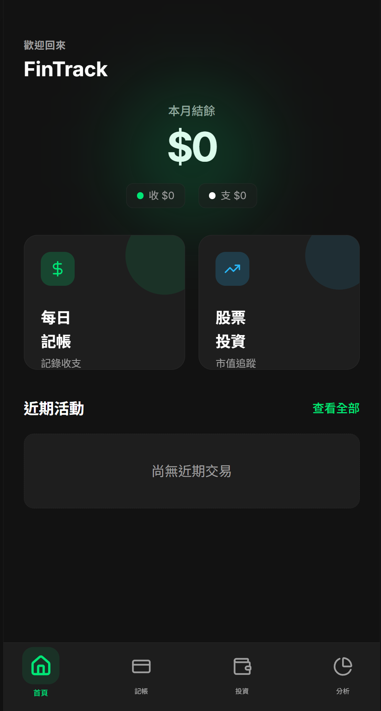
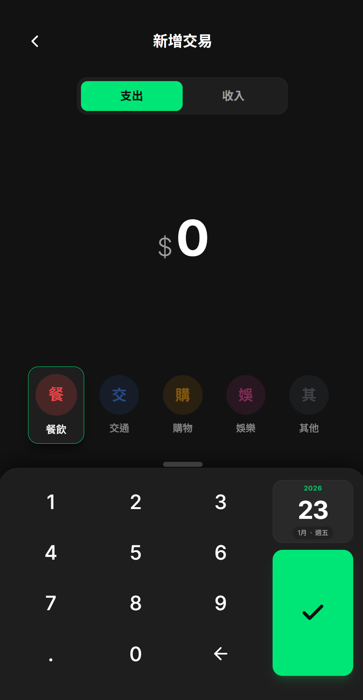
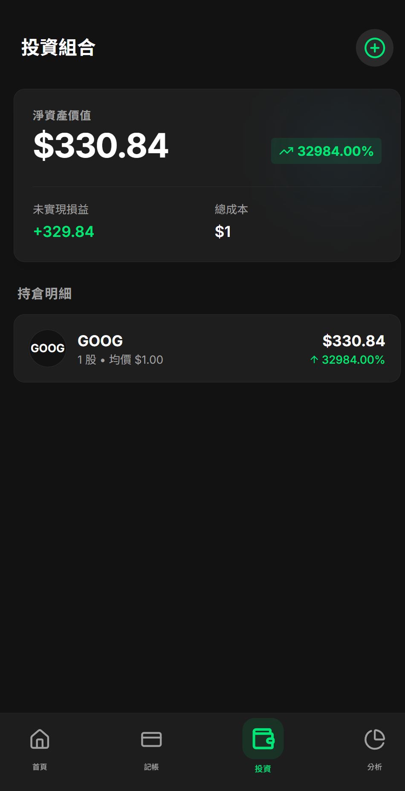

# 💰 FinTrack - 個人記帳&股票投資紀錄app


> A mobile-first PWA for tracking expenses and monitoring stock investments in real-time.
>
> 一款行動優先的漸進式網頁應用程式 (PWA)，用於記錄日常開銷並即時追蹤股票投資組合。

---

## 🚀 Live Demo (線上預覽)

👉 **[Click here to open App / 點擊開啟應用程式](https://fintrack-n3pa.vercel.app)**

*💡 **Tip**: For the best experience, open this link on your mobile phone and add it to your **Home Screen**. It works just like a native app!*
*💡 **提示**：建議使用手機開啟連結，並將其加入**主畫面**，即可享有如同原生 App 的全螢幕流暢體驗！*

---

## 📸 Screenshots (應用截圖)

| Dashboard (首頁) | Expense Tracker (記帳) | Stock Portfolio (投資) |
|:---:|:---:|:---:|
|  |  |  |

---

## ✨ Key Features (核心功能)

### 📊 Expense Tracking (記帳功能)
- **Smart Calculator UI**: iOS-style calculator interface for quick and intuitive data entry.
  - **智慧計算機介面**：彷 iOS 風格的計算機設計，讓輸入金額更快速直覺。
- **Visual Categories**: Horizontal scrollable icon selector for clear categorization.
  - **視覺化類別**：直覺的橫向捲動 Icon 選單，分類一目瞭然。
- **CRUD Operations**: Support for adding and deleting transaction records effortlessly.
  - **增刪管理**：完整支援記帳紀錄的新增與刪除功能。

### 📈 Stock Portfolio (股票投資組合)
- **Real-time Data**: Integrated with **Finnhub API** to fetch live stock quotes (e.g., AAPL, TSLA).
  - **即時報價**：串接 **Finnhub API**，獲取美股（如 AAPL, TSLA）即時股價。
- **Portfolio Management**: Automatically calculates unrealized Profit & Loss (P&L) based on average cost.
  - **投資管理**：輸入持倉與成本，系統自動計算未實現損益與報酬率。
- **Live Status Indicators**: Color-coded UI (Red/Green) indicating real-time market trends.
  - **漲跌提示**：透過紅綠顏色視覺化呈現當前股價漲跌趨勢。

### 📱 PWA Experience (PWA 體驗)
- **Installable**: Can be installed on iOS/Android home screens via `manifest.json`.
  - **可安裝**：支援透過瀏覽器將網頁安裝至手機主畫面，無須下載 App。
- **Responsive Layout**: Solved iOS Safari viewport issues using `100dvh` for a native feel.
  - **響應式佈局**：使用 `100dvh` 解決 iOS Safari 視窗高度問題，操作體驗極佳。

---

## 🛠 Tech Stack (技術棧)

* **Framework**: React 18, TypeScript
* **Build Tool**: Vite
* **Styling**: Tailwind CSS
* **State Management**: React Hooks (useState, useEffect)
* **Data Persistence**: LocalStorage API
* **API Integration**: Axios, Finnhub Stock API
* **Icons**: Lucide React
* **Charts**: Recharts
* **Deployment**: Vercel (CI/CD)

---

## 📦 Installation & Setup (安裝與執行)

If you want to run this project locally, follow these steps:
若您希望在本地端運行此專案，請依照以下步驟：

1.  **Clone the repository (下載專案)**
    ```bash
    git clone [https://github.com/DINOHO222/fintrack-app.git](https://github.com/DINOHO222/fintrack-app.git)
    cd fintrack-app
    ```

2.  **Install dependencies (安裝依賴)**
    ```bash
    npm install
    ```

3.  **Setup Environment Variables (設定環境變數)**
    Create a `.env` file in the root directory and add your API key:
    在專案根目錄建立 `.env` 檔案並填入以下內容：
    ```env
    VITE_API_BASE_URL=[https://finnhub.io/api/v1](https://finnhub.io/api/v1)
    VITE_STOCK_API_KEY=your_finnhub_api_key_here
    ```
    *(Get a free API key from [Finnhub.io](https://finnhub.io/))*

4.  **Run Development Server (啟動開發伺服器)**
    ```bash
    npm run dev
    ```

---

<p align="center">
  Made by Dino
</p>